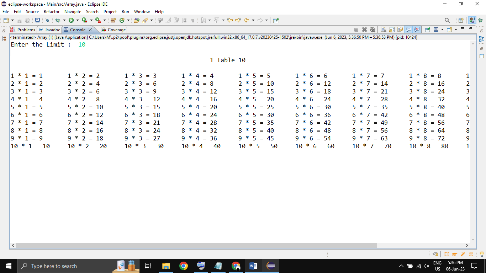

# Java-Multiplication-Table
Java Multiplication Table Using Jagged Array

## Features
- Generate Multiplication Table of N Number of User Input
- Printing Multiplication Table using 2D Array
- Printing Using Jagged Array
- Easy to Understand Code

## Installation
- Just, Clone this repository - 
````bash 
git clone https://github.com/SLoharkar/Java-Multiplication-Table.git
````
- Copy Code of Array.java and Paste on Java Online Compiler https://www.programiz.com/java-programming/online-compiler/ 
- Run File Using Any Java Application Like Eclipse IDE For Java Developer or Visual Studio Code

## Program Output
<p align="left">

</p>
<br></br><br></br>


## Dependencies
- `Eclipse-IDE For Java Developer`
- `jdk-1.8 or Java 20`
- `Windows OS`

